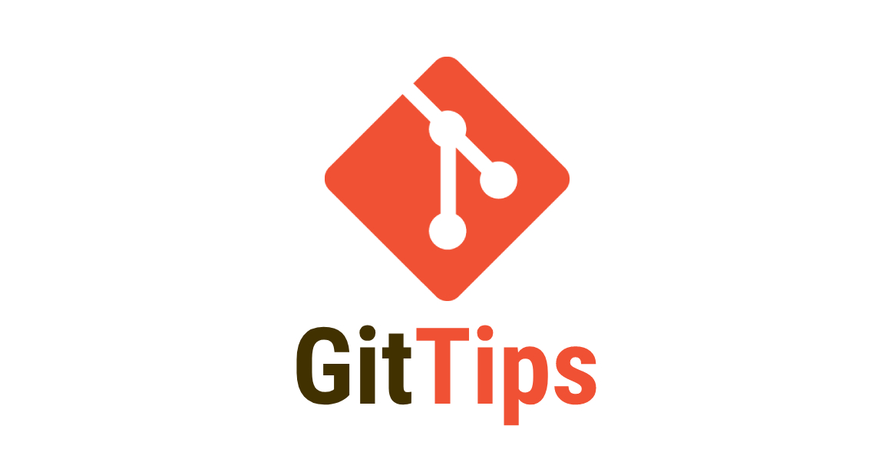

<p align="center">
  
</p>

<h1 align="center">Git Tips</h1>

<p align="center">📝 Git Tips es un listado de casos de uso, ejemplos y consejos prácticos y fáciles de entender sobre Git y Gitflow.</p>

<p align="center">
  <a title="MIT License" href="LICENSE.md">
    
  </a>
  <a title="Twitter: JoseJ_PR" href="https://twitter.com/JoseJ_PR">
    
  </a>  
  <a title="Github: Sponsors" href="https://github.com/sponsors/JoseJPR">
    
  </a>
  <br />
  <br />
</p>

## 🔖 Description
Git fue diseñado por [Linus Torvalds](https://es.wikipedia.org/wiki/Linus_Torvalds) y creado pensando en la eficiencia y la confiabilidad del mantenimiento de versiones de aplicaciones cuando estas tienen un gran número de archivos de código fuente.

Git nos permite trabajar en proyectos de software independientemente del lenguaje que utilicemos y del número de personas que trabajen en él. Podrás gestionar todos los estados de progresión de cada proyecto creando ramas para desarrollar nuevas características concretas para la resolución de bugs, para desplegar en entornos concretos entre otras tareas.

Por otro lado, Gitflow no es más que una guía o workflow introducido por [Vincent Driessen](https://nvie.com/about/) con el que conseguimos estandarizar el flujo de trabajo dentro del proyecto y del equipo y de esta forma poder trabajar de forma ordenada según el tipo de tarea que estemos llevando a cabo en nuestro proyecto y podemos clasificarlas en ramas principales y ramas de soporte.

## Estados de Git

Estado 1 -> Working Directory (Directorio de trabajo local) \
Estado 2 -> Staging Area (Area de preparación local) \
Estado 3 -> Local Repository (Repositorio local o directorio Git)


El flujo de trabajo básico en Git es algo así: \
1.- Modificas una serie de archivos en tu directorio de trabajo. \
2.- Preparas los archivos, añadiéndolos a tu área de preparación. \
3.- Confirmas los cambios, lo que toma los archivos tal y como están en el área de preparación y almacena esa copia instantánea de manera permanente en tu directorio de Git.

Es importante que accedas y te leas detenidamente la información de [Fundamentos de Git](https://git-scm.com/book/es/v2/Inicio---Sobre-el-Control-de-Versiones-Fundamentos-de-Git) antes de comenzar a realizar todos los casos de uso que verás a continuación.

## Casos de uso y comandos de Git

### Configurar nombre y email

Configura un nombre de usuario:
```bash
git congit --global user.name "JoseJPR"
```
Configura un email:
```bash
git congit --global user.email "me@josejpr.com"
```

### Ver nuestra configuración de git

Muestra la configuración de tu git:
```bash
git config --list
```

### Iniciar repositorio en carpeta actual

Inicias un repositorio local:
```bash
git init 
```

### Añadir archivos al Estado 2

Añade archivos al Estado 2:
```bash
git add archivo.txt
```

Si tenemos dos o mas archivos podemos utilizar el flag --all para añadirlos todos con un solo comando:
```bash
git add --all
```

### Ver el estado de los archivos

Muestra que archivos están añadidos al Estado 2 y cuales no:
```bash
git status
```

### Restaurar version anterior de un archivo en Estado 1

Imagina que has modificado el archivo.txt (has añadido un "Hola"), podrás revertir estos cambios con (Es igual a git checkout -- archivo.txt):
```bash
git restore archivo.txt
```

### Añadir la referencia de un repositorio remoto (Github por ejemplo) a nuestro local

Imagina que has creado un repositorio remoto y quieres agregar la referencia al repositorio local:
```bash
git remote add origin https://github.com/JoseJPR/practicas-git
```

### Ver que repositorio remoto tenemos asignado a nuestro Working Directory local

Quizas a futuro te sea necesario revisar el listado de los repositorios remotos tienes asignados a tu repositorio local:
```bash
git remote -v
```

### Subir código actualizado a una rama remota

Imagina que quieres alojar tu código en el repositorio remoto (siendo master la rama remota):
```bash
git push origin master
```

### Obtén código actualizado de la rama remota

Imagina que quieres obtener el código desde el repositorio remoto (siendo master la rama remota):
```bash
git pull origin master
```

### Ver ramas locales y remotas

Ver ramas locales:
```bash
git branch
```

Ver ramas remotas:
```bash
git branch -r
```

Ver ramas locales y remotas:
```bash
git branch -a
```

### Limpiar todos los archivos que aún no hayan pasado al Estado 2

Imagina que has creado un archivo nuevo llamado "archivo-nuevo.txt" y nunca ha sido añadio al Estado 2.

Elimina ese archivo y todos los que haya en el workspace que no hayan pasado nunca a Estado 2:
```bash
git clean -f
```

Muestra información de los archivo que serán eliminados:
```bash
git clean -n
```

### Eliminar archivos concretos

Imagina que tienes el archivo "archivo-test.txt" en Estado 1. Tendrás que realizar un borrado de sistema rm -r (Mac o Ubuntu) del (Win):
```bash
rm -r archivo-test.txt
```
```bash
del archivo-test.txt
```

Imagina que tienes el archivo "archivo-test.txt" en Estado 2. Elimina el archivo del espacio de trabajo y del Estado 2:
```bash
git rm -f archivo-test.txt
```

Imagina que tienes el archivo "archivo-test.txt" en Estado 3. Elimina el archivo del espacio de trabajo, colocará una modificación (archivo eliminado) en el Estado 2 y estará a la espera de ser commiteado este cambio al Estado 3:
```bash
git rm archivo-test.txt
```

### Restaurar archivo eliminados

Imagina que has eliminado el archivo "archivo-test.txt" que estaba en Estado 2:
```bash
git restore archivo-test.txt
```

Imagina que has eliminado el archivo "archivo-test.txt" que estaba en Estado 3. Recupera el archivo eliminado y lo coloca en Estado 2:
```bash
git restore --staged archivo-test.txt
```
Recupera el archivo eliminado y lo situa de nuevo en Estado 3:
```bash
git restore archivo-test.txt
```

### Restablecer los archivos de Estado 2 a Estado 1

Imagina que necesitas quitar todos los archivos que has añadido al Estado 2 y los restablece al Estado 1:
```bash
git reset HEAD
```

Imagina que tienes que hacer lo anterior pero sólo con el archivo "archivo-test.txt":
```bash
git reset HEAD archivo-test.txt
```

### Revertir commits

Imagina que quieres volver a un estado anterior teniendo en cuenta un commit concreto. 

Visualiza el listado de commits de la rama actual:
```bash
git log
```
Revierte nuestro estado actual al que teníamos en el commit seleccionado:
```bash
git revert {id del commit}
```
Añade todos los archivos revertidos:
```bash
git add *
```
Realizamos un nuevo commit dejando constancia:
```bash
git commit -m "Hemos revertido hasta el commit xxx"
```

### Renombrar archivos

Imagina que tenemos dos archivos, uno llamado "archivo-test.txt" y queremos renombrarlo a "archivo-test-2.txt":
```bash
git mv archivo-test.txt archivo-test-2.txt
```

Esto realmente lo que hace es:
```bash
mv archivo-test.txt archivo-test-2.txt && git add archivo-test-2.txt && git rm archivo-test.txt
```

### Trabajar con ramas

Para mostrar el listado de ramas que tenemos utiliza:
```bash
git branch
```

Para crear una rama utiliza:
```bash
git branch nueva-rama
```

Para eliminar una rama utiliza:
```bash
git branch -d nueva-rama
``` 

Para modificar el nombre de una rama utiliza:
```bash
git branch -m antiguo-nombre-rama nuevo-nombre-rama
```

### Viajar en el tiempo

Si hacemos git log veremos todos los commits de la rama actual y podremos obtener el identificador de un commit anterior.

Imagina que tienes un commit con identificador "49f3733f9786b8d0a1d88f19ac429164d21e45ff", para viajar a ese commit utiliza:
```bash
git checkout 49f3733f9786b8d0a1d88f19ac429164d21e45ff
```

Imagina que quieres volver al último commit de la rama, utilizaremos la misma sentencia pero añadiendo el nombre de la rama, por ejemplo "main":
```bash
git checkout main
```

### Moverse entre ramas

Imagina que necesitas moverte desde la rama "main" a la rama "develop":
```bash
git checkout develop
```

### Crear una rama y moverse con un sólo comando

Imagina que necesitas crear una nueva rama con el nombre "nueva-rama" y quieres moverte en el mismo comando:
```bash
git checkout -b nueva-rama
```

### Enlazar Ramas con Merge 

Imagina que estás trabajando con dos ramas, una "develop" y otra "feature-nuevo" y quieres llevar todos tus cambios desde "feature-nuevo" a la rama "develop".

Tienes que situarte en la rama develop:
```bash
$git checkout develop
```

Tienes que traerte todos los cambios a develop:
```bash
git merge feature-nuevo
```

### Alojar cambios en stash para no tener que realizar commit.

Imagina que tienes varios cambios que estas realizando en tu rama pero un compañero te comenta que necesita que te cambies de rama para revisarle un desarrollo pero NO quieres realizar commits de tus cambios. Existe algo que se llama stash, una pila de cambios, que puedes utilizar para almacenar temporalmente cambios.

Para almacenar cambios en stash utiliza:
```bash
git stash
```

Para obtener los cambios de la pila, uno a uno utiliza:
```bash
git stash pop
```

Para limpiar todos los cambios que estén en stash utiliza:
```bash
git stash clear
```

Para ver el listado de elementos en stash utiliza:
```bash
git stash list
```

### Trabajar con TAGs.

Podemos crear Tags ligeros o tags con metadatos.

Para crear un tag ligero utiliza:
```bash
git tag nombre_del_tag
```

Para crear tags con metadatos añadidos utiliza:
```bash
git tag -a v1.0.0 -m "Comentario del TAG"
```

Para crear tags con metadatos añadidos de un commit concreto utiliza:
```bash
git tag -a v1.0.1 -m "Comentario del TAG" 49f3733f9786b8d0a1d88f19ac429164d21e45ff
```

Para ver el listado de tags utiliza:
```bash
git tag
```

Para moverte a un tag concreto utiliza:
```bash
git checkout nombre_del_tag
```

Para eliminar un tag concreto utiliza:
```bash
git tag -d nombre_del_tag
```

Si necesitas subir un tag a tu repositorio remoto utiliza:
```bash
git push origin master --tags
```

### Trabajar con repositorios remotos

Imagina que necesitas listar los repositorios remotos agregados a tu local:
```bash
git remote
```

Puedes visualizar más información, por ejemplo la url del repositorio remoto utilizando:
```bash
git remote -v
```

### Asignar un repositorio o más remotos a tu local

Imagina que quieres trabajar con github o gitlab, necesitas asignar un repositorio remoto a tu repositorio local:
```bash
git remote add origin https://github.com/JoseJPR/practicas-git
git remote add external https://github.com/JoseJPR/practicas-git-2
```

Podemos utilizar origin o upstream ya que son convención pero podemo utilizar el nombre local que queramos por ejemplo:
```bash
git remote add external https://github.com/JoseJPR/practicas-git
git remote add external https://github.com/JoseJPR/practicas-git-2
```

Es posible tener dos repositorios remotos asignados a uno local, solo tienes que ejecutar la sentencia git remote add y agregar los dos, uno por cada ejecución de la sentencia, por ejemplo:
```bash
git remote add origin https://github.com/JoseJPR/practicas-git
git remote add external https://github.com/JoseJPR/practicas-git-2
```

### Descargar información y archivos a tu local

Con git fetch puedes actualizar los metadatos de nuestro repositorio en estado 3 origin/x en local y nos descargamos los archivos:
```bash
git fetch
```

Imagina que necesitas obtener los cambios a tu repositorio local en estado 1, tienes que hacer un merge utilizando:
```bash
git merge origin/x
```

Con git pull te ahorras un paso ya que hace los dos en uno, descarga metadatos y archivos y los mergea con nuestra rama local:
```bash
git pull
```

### Subida información y archivos desde tu local a remoto

Imagina que has trabajado en tu código, finalizas un feature y quieres alojar lo cambios en el repositorio remoto.

Tienes que agrear los archivos que han sufrido cambios, imagina que ha cambiado el contenido de "archivo-test.txt":
```bash
git add archivo-test.txt
git commit -m "Updated archivo 5"
git push
```

### Ver diferencias realizadas en un commit o tab
Imagina que necesitas ver las diferencias en el código de un commit concreto con identificador "49f3733f9786b8d0a1d88f19ac429164d21e45ff":
```bash
git show 49f3733f9786b8d0a1d88f19ac429164d21e45ff
```

Imagina que necesitas ver las diferencias en el código de un tag concreto con identificador "v.10.0.0":
```bash
git show v.10.0.0
```

Si quieres ver diferencias entre dos commits utiliza:
```bash
git diff 727bcbd6dfe00f623f708faa6f0ea7d9803c1aa7 0beef0be4883917a7f6704d7f1ac8403108a87ab
```

### Ver historico de trabajo agrupado por nombre de usuario

Imagina que necesitas ver el listado de commits agrupado por usuarios:
```bash
git shortlog
```

Imagina ver un resumen del numero de commit:
```bash
git shortlog --summary --numbered
```

### Ver el tag más próximo a mi actual commit
Imagina que quieres ver a que tag corresponde el actual commit:
```bash
git describe
```

El resultado será algo como "v.1.0.0-1-g2b31eb2", "v.1.0.0" es el nombre del tag, "1" es el numero de commit tras la creación del tab "g2b31eb2" es un identificador unico de git.

### Obtener quién hizo qué cambio en un archivo concreto
Imagina que necesitas saber que persona realizó un cambio concreto en un archivo de tu proyecto, en este ejemplo en el archivo "README.md":
```bash
git blame README.md
```

Imagina que solo quieres saber que ocurrio entre dos lineas de un archivo concreto, por ejemplo lineas 1 y 10:
```bash
git blame -L 1,10 README.md
```

### Buscar un patrón de texto entre todos los archivos
Imagina que necesitas encontrar en cuantos archivos existe la palabra "console":
```bash
git grep console
```

Si necesitas ver también la línea en la que existe la palabra:
```bash
git grep -n console
```

Si necesitas ver el número de veces que existe en el proyecto:
```bash
git grep -c console
```

## Enlaces de interés

* [Vídeo: The gitflow workflow - in less than 5 mins.](https://www.youtube.com/watch?v=1SXpE08hvGs)
* [Vídeo: Curso Git y Github](https://www.youtube.com/playlist?list=PLDbrnXa6SAzUyitkL4zcnWO07HxG0BvmS)
* [Documentación: Fundamentos de Git](https://git-scm.com/book/es/v2/Inicio---Sobre-el-Control-de-Versiones-Fundamentos-de-Git)
* [Documentación: Atlassian - Tutorial](https://www.atlassian.com/es/git/tutorials)

## License

[MIT](LICENSE.md)

## This README.md file has been written keeping in mind

[GitHub Markdown](https://guides.github.com/features/mastering-markdown/) \
[Emoji Cheat Sheet](https://www.webfx.com/tools/emoji-cheat-sheet/)